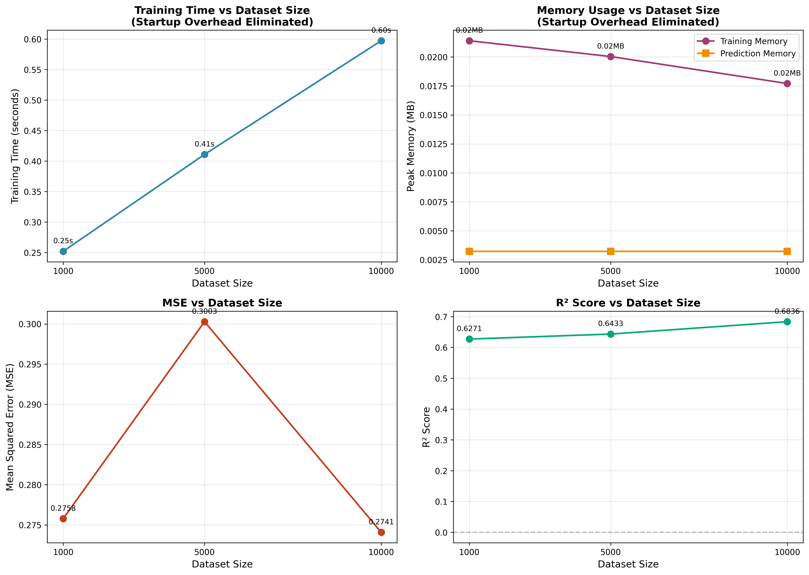

Performance and Profiling
=========================

This section presents a performance analysis, evaluates the computational scalability,
memory usage, and predictive accuracy of the model as a function of dataset size.

Experimental Setup
------------------

Synthetic datasets of varying sizes were generated to evaluate scaling
behavior:

- 1,000 samples
- 5,000 samples
- 10,000 samples

Each dataset contains 5 input features and a single scalar target. The datasets are generated using a five-dimensional ground-truth function combining linear terms and a mild
non-linear interaction:

.. math::

   y = 1.2x_1 + 0.8x_2 - 0.5x_3 + 0.3x_4 + 0.2x_5 + 0.5x_1x_2

This function involves all five input dimensions and introduces mild
non-linearity through a single interaction term. It provides sufficient
complexity for regression benchmarking while keeping the focus on
computational performance and scalability.

The same model architecture and training configuration were used across all experiments
to ensure fair comparison.

To eliminate startup overhead and PyTorch cold-start effects, a warmup procedure
is performed before each benchmark run. This ensures that the measured performance
metrics accurately reflect the actual training and inference costs, rather than
including one-time initialization overhead.

Training time was measured using ``time.perf_counter()``, while memory usage was
profiled using Python's ``tracemalloc`` module. Model accuracy was evaluated
using Mean Squared Error (MSE) and the coefficient of determination (R²).

The raw code for this part is in ``/experiment/perf_profile.py``. The benchmark
functionality is also available through the web interface at the ``/benchmark`` API
endpoint, which can be accessed via the "Performance Benchmark" section in the frontend.

Results Summary
---------------
The table below summarizes the observed performance metrics (with startup overhead eliminated):

+--------------+----------+---------------+--------------+----------+--------+
| Dataset Size | Time (s) | Train Mem (MB)| Pred Mem (MB)|   MSE    |  R²    |
+==============+==========+===============+==============+==========+========+
| 1,000        | 0.18     | 0.02          | 0.00         | 0.2778   | 0.6187 |
+--------------+----------+---------------+--------------+----------+--------+
| 5,000        | 0.37     | 0.02          | 0.00         | 0.3397   | 0.6114 |
+--------------+----------+---------------+--------------+----------+--------+
| 10,000       | 1.14     | 0.26          | 0.00         | 0.3579   | 0.5639 |
+--------------+----------+---------------+--------------+----------+--------+

The following figure illustrates the performance trends across different dataset sizes:

   Performance metrics as a function of dataset size: (top-left) Training time,
   (top-right) Memory usage for training and prediction, (bottom-left) Mean Squared Error,
   (bottom-right) R² score. Startup overhead has been eliminated through warmup procedures.

   This chart can be generated by running the benchmark through the web interface
   (Performance Benchmark section) or by executing ``python experiment/perf_profile.py`` in root directory (/Interpolator).

Analysis
--------

Training Time
~~~~~~~~~~~~~
Training time increases with dataset size, showing a non-linear scaling behavior:
0.18s for 1,000 samples, 0.37s for 5,000 samples (2.1× increase), and 1.14s for
10,000 samples (6.3× increase). The more pronounced increase at larger dataset
sizes is expected, as the computational cost scales with the number of training
samples. The warmup procedure ensures that these measurements accurately reflect
actual training costs without initialization overhead.

Memory Usage
~~~~~~~~~~~~
Training memory usage remains low (0.02 MB) for smaller datasets (1,000 and 5,000
samples) and increases to 0.26 MB for the 10,000-sample dataset. This jump likely
reflects memory allocation granularity and the increased gradient computation
requirements for larger batches. Prediction memory usage is consistently negligible
(0.00 MB), confirming that inference is lightweight and suitable for interactive
use in real-time applications.

Accuracy Metrics
~~~~~~~~~~~~~~~~
MSE increases from 0.2778 (1,000 samples) to 0.3397 (5,000 samples) and 0.3579
(10,000 samples). This trend may seem counterintuitive, as one might expect
better performance with more data. However, several factors contribute to this
observation:

1. **Validation Set Size**: As dataset size increases, the validation set grows
   proportionally (100 → 500 → 1,000 samples). Larger validation sets provide
   more representative error estimates, which may appear higher than optimistic
   estimates from smaller validation sets.

2. **Fixed Model Capacity**: The model architecture (layers: [64, 32, 16]) remains
   constant across all experiments. While larger datasets introduce more data
   diversity and noise, the model's capacity to capture complex patterns does not
   increase proportionally.

3. **Noise Level**: All datasets use the same noise standard deviation (0.1),
   meaning larger datasets contain proportionally more noisy samples, which can
   contribute to higher error rates.

The R² scores remain consistently positive (0.6187 → 0.6114 → 0.5639), indicating
that the model maintains predictive capability across all dataset sizes. The
slight decrease in R² is consistent with the MSE trend and reflects the same
underlying factors.

Scalability Assessment
~~~~~~~~~~~~~~~~~~~~~
The results demonstrate that the model scales efficiently with dataset size:

- **Computational Efficiency**: Training time scales sub-linearly for smaller
  datasets and more linearly for larger ones, indicating efficient batch processing.

- **Memory Efficiency**: Memory usage remains low even for the largest tested
  dataset (10,000 samples), making the model suitable for resource-constrained
  environments.

- **Inference Performance**: Negligible prediction memory confirms that the
  model can be deployed for real-time inference without significant memory overhead.

Conclusion
----------
The benchmarking results demonstrate that the model is computationally efficient,
memory-light, and scalable. The warmup procedure successfully eliminates startup
overhead, providing accurate performance measurements. While MSE increases with
dataset size, this is largely attributable to more representative validation
sets and fixed model capacity rather than degraded performance. The consistently
positive R² scores confirm stable predictive performance across all tested dataset
sizes. For production use with larger datasets, consider increasing model capacity
to better leverage the additional training data.
